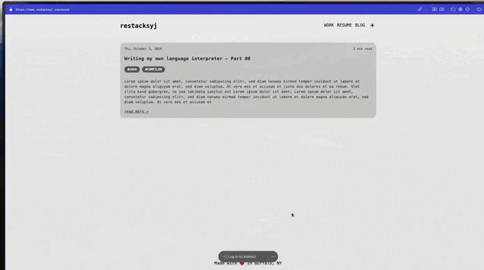

> You can check the app out [SpaceNumber](https://github.com/restacksyj/space_number) \
> Go the releases section and run the app, don't forget to star the repo.

For a while, I wanted to get my hands dirty in building a proper native MacOS app using Swift. 
On one fine day, I was going through my desktop spaces toggling between them using my `Ctrl + {spacenumber}` and I realized I opened one of my apps in the wrong desktop space. Let me breakdown the problem for you. 

I always have a single app open in a single desktop space. My terminal at 1, my browser at 2 and obsidian at 3, spotify at 6. This makes it easier for my brain to just go directly to the particular space/app without any brain overload. But for some reason, sometimes my app goes into some different desktop space and I don't realize it until I switch between apps. I realized I need some indication on which desktop space am I on while switching. Like a normal person, I just searched google and I found out there are apps that do it but unfortunately all of them show your desktop space number in the menu bar and for my sanity I keep my menu bar hidden at all times :/

I got a brain spark right at this moment, why not I create an app that does it. Hold on, this is where I wear my coding hats and start building. I realized the open source app 
[WhichSpace](https://github.com/gechr/WhichSpace)  updates the desktop space in the menu bar, so my brain goes like clone this repo, figure out how to build this and then just add another function that calls some Widget to display text in the middle of the screen. So simple right :)

